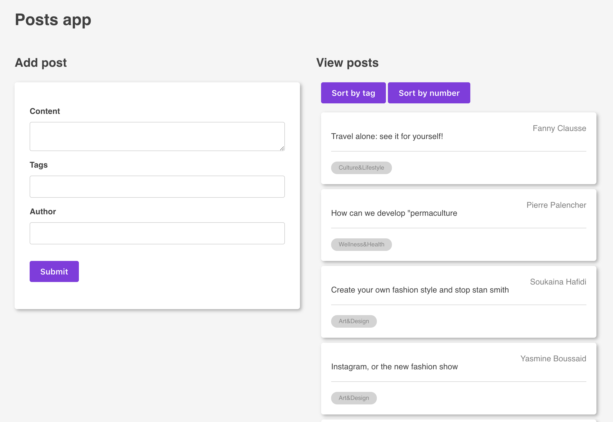

This project was bootstrapped with [Create React App](https://github.com/facebook/create-react-app).

## Available Scripts

In the project directory, you can run:

### `npm start`

Runs the app in the development mode. 
Open [http://localhost:3000](http://localhost:3000) to view it in the browser.

The page will reload if you make edits. 
You will also see any lint errors in the console.

### `npm test`

Launches the test runner in the interactive watch mode. 
See the section about [running tests](https://facebook.github.io/create-react-app/docs/running-tests) for more information.

### `npm run build`

Builds the app for production to the `build` folder. 
It correctly bundles React in production mode and optimizes the build for the best performance.

The build is minified and the filenames include the hashes. 

### `npm run serve`

Builds the app and serves it on [http://localhost:5000](http://localhost:5000) to view it in the browser.

#### Notes on the technical test

I started with the idea to learn new things while coding for this test. It was the right time to test the new React feature: hooks.

It enabled me to avoid Redux complexity, and I am impressed by the result. I used create-react-app to bootstrap the project quickly, and added the alpha version of React to activate these hooks.

I chose to use `react-testing-library` in addition with `jest` in order to take advantage of this technical test because I already knew `enzyme`.

I tried to respect the limit of 3 hours, but lost some time discovering these test frameworks, so I did not had the time to add drag-and-drop and a PDF library.

Therefore, I chose to deliver a working product instead of some unfinished features and used the remaining time to refactor and cut into small pieces my current code.

In addition, if I had more time, I would add more unit and functional tests.

